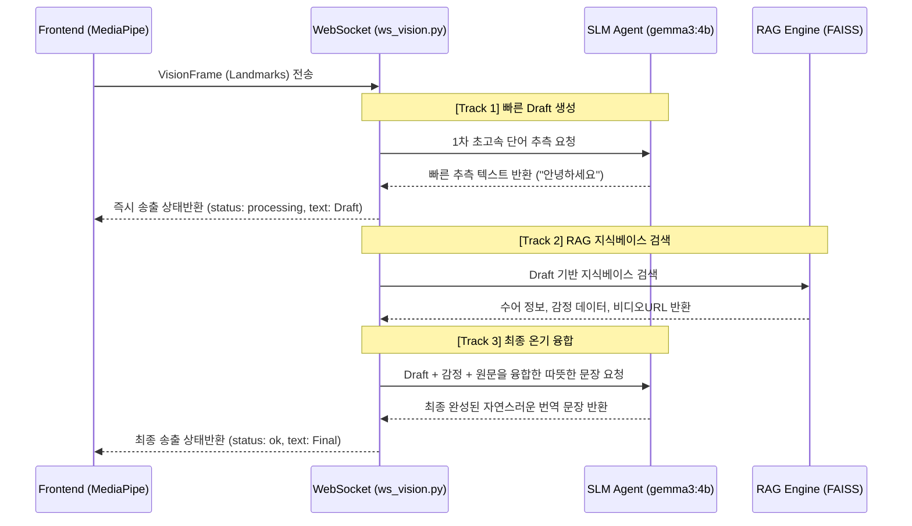

# 🌟 Project ITDA: 수어 번역 하이브리드 파이프라인 설계서

## 1. 개요 (Overview)
본 문서는 Project ITDA의 1단계(Vision 데이터 수집)와 2단계(번역 및 온기 부여) 파이프라인을 잇는 **하이브리드 모션 번역 아키텍처**를 설명합니다. 
현재 번역 프로세스는 응답 지연(Latency)을 최소화하면서도, 수어에 담긴 '감정'을 분석하여 '온기 있는 언어'로 변환하기 위해 **SLM (Small Language Model)**과 **RAG (Retrieval-Augmented Generation)**를 결합하여 설계되었습니다.

---

## 2. 시스템 아키텍처 다이어그램

---

## 3. 파이프라인 상세 처리 과정 (3-Track System)

현재 웹소켓(`ws_vision.py`)을 통해 들어오는 단일 프레임은 아래 세 가지 트랙을 거칩니다.

### Track 1: 응답 지연 은닉을 위한 초고속 Draft 예측 (Fast Prediction)
*   **목적:** 사용자가 수어를 할 때 번역 결과를 기다리는 시간을 최소화하여 체감 속도를 높임.
*   **프로세스:** `slm_agent.predict_fast()` 연동
*   **특징:** 프론트엔드 UI에 우선적으로 `처리 중(processing)` 상태의 가번역(Draft)을 띄어줍니다.

### Track 2: 감정 기반 맥락 RAG 검색 (Context Retrieval)
*   **목적:** 수어에 담긴 고유의 의미와 감정을 데이터베이스(FAISS Vector DB)에서 꺼냄.
*   **프로세스:** `rag_engine.retrieve_with_emotion()` 연동
*   **특징:** Track 1에서 도출된 키워드를 확장하여, 가장 유사한 동작에 할당된 긍정적/따뜻한 번역 데이터 및 감정 상태를 확보합니다.

### Track 3: 온기가 담긴 최종 문장 완성 (Final Fusion)
*   **목적:** 딱딱한 기계 번역이 아닌 공감 능력을 가진 인간 통역사처럼 부드럽게 문맥을 다듬음.
*   **프로세스:** `slm_agent.predict_with_rag()` 연동
*   **특징:** `[Track 1번 데이터 + Track 2번 데이터]`를 결합하여 Ollama(gemma3)에 프롬프트로 주입, 완벽한 문장으로 결론짓습니다.

---

## 4. ⚡ 고도화 계획 및 개발팀 과제 (Roadmap)

시스템의 뼈대는 완성되었으나, 실제 서비스 연동을 위해서는 아래의 과제들을 해결하여 하드코딩된 부분들을 실제 데이터 흐름으로 치환해야 합니다.

### [과제 1] MediaPipe 좌푯값의 인스트럭션 변환 텍스트화 (가장 시급)
*   **현재 상태:** `predict_fast` 시 프롬프트가 *"손목이 이마에서 가슴으로 부드럽게..."* 처럼 하드코딩 되어있습니다.
*   **목표 로직:** `VisionFrame`에 담긴 Landmark x,y,z 좌표들을 누적 연산하여, SLM이 이해할 수 있는 자연어 형태의 모션 메타데이터(예: `Right_Hand_Move: Down, Palm_Direction: Inward`)로 치환하는 전처리 모듈이 Backend 또는 Frontend 앞단에 추가되어야 합니다.

### [과제 2] 모듈 간 동적 파라미터 바인딩
*   **현재 상태:** RAG 검색 시 쿼리가 `"안녕하세요"`로 고정(`ws_vision.py`의 72라인)되어 있습니다.
*   **목표 로직:** Track 1에서 반환된 `fast_pred` 결괏값을 클리닝하여, RAG 검색의 Query 파라미터에 동적으로 할당하도록 수정해야 합니다.

### [과제 3] 프레임 버퍼링 제어 (네트워크/연산 부하 방지)
*   **현재 상태:** 매 WebSocket 프레임마다 SLM을 무차별 호출할 시 로컬 모델 리소스 한계로 서버 병목이 우려됩니다.
*   **목표 로직:**
    *   **Motion Detection Trigger:** 손바닥이 보이지 않거나 동작이 일시적으로 멈췄을 때만 번역 Track을 가동하게끔 윈도우(Window) 버퍼링 설계.
    *   **Debounce & Throttle:** 동일 동작이 연속될 때는 Track 1만 갱신하고, 모션 종료 시점에만 Track 2와 Track 3를 실행하는 로직으로 분배 최적화 필요.

---

## 5. 🏃‍♂️ 금일 고도화 실행 계획 (3인 공동 개발 체계)

현재 다른 팀원분들이 4~9단계(3D 렌더링, STT 등)를 고도화하는 동안, **[사용자님]께서 번역 파이프라인(1단계 Vision ~ 3단계 AI 연동)의 전 구간을 전담**하여 개발하고 계십니다. 
따라서 본 구역의 고도화는 데이터 흐름(Data Flow)에 따라 **앞단에서 뒷단으로(Frontend -> Backend -> AI)** 차근차근 순차적으로 파이프라인을 관통시키는 구조가 가장 효율적입니다.
### [Step 1: Frontend] 데이터 정제 및 버퍼링 (가장 먼저 수행)
*   **작업 파일:** `frontend/js/vision.js`
*   **목표:** 서버를 폭파시키지 않기 위한 방어막과, 의미 있는 데이터를 만드는 작업.
*   **Action:** 
    1.  0.5초 단위로 묶어서 보내거나, 모션 변화량이 클 때만 전송하도록 **Throttling/Debounce** 로직 추가.
    2.  Landmark(x,y,z)를 연산해 "손 이동 방향(상/하)" 등의 **메타데이터(Meta Features)**로 정제하여 JSON에 포함.

### [Step 2: Backend] 무한 호출 잠금 및 하드코딩 제거
*   **작업 파일:** `api/routers/ws_vision.py`
*   **목표:** 프론트에서 깨끗하게 넘어온 데이터를 안정적으로 수신하고 다음 파이프라인에 동적으로 전달.
*   **Action:**
    1.  동일 세션에 대해 `is_processing` 플래그를 두어 중복 호출을 막는 **호출 잠금(Lock) 제어** 적용.
    2.  `search_keyword = "안녕하세요"` 하드코딩을 삭제하고, Track 1(`fast_pred`) 결과값을 RAG 엔진 쿼리에 직접 연동.

### [Step 3: AI / NLP] 프롬프트 엔지니어링 동적 매핑
*   **작업 파일:** `api/services/slm_agent.py`
*   **목표:** AI가 실제상황을 보고 제대로 추리하도록 완성.
*   **Action:** 
    1.  하드코딩된 *"손목이 이마에서 가슴으로..."* 문구 삭제.
    2.  프론트에서 넘어온 '메타데이터'를 기반으로, Ollama(gemma)가 동작을 보고 1단어로 추측하게끔 **시스템 프롬프트(System Prompt) 동적 생성 로직** 추가.

---

## 6. 📝 패치 및 수정 이력 (Changelog)

### [2026-04-17] 1~3단계 안정화 및 동적 데이터 연동 완료
**1. Frontend (`vision.js` & `websockets_schema.py`)**
*   **Throttling 적용:** 무차별 프레임 전송 방지를 위해 `sendFrameWS`에 500ms(0.5초) 버퍼링 로직 추가.
*   **Meta Features 추출:** 원시 좌표(x,y,z) 외에 손 이동 방향을 계산한 `movement` 필드와 `hand_count`를 Pydantic 스키마에 맞춰 백엔드로 전송하도록 수정.

**2. Backend (`ws_vision.py`)**
*   **Session Lock 구현:** `ConnectionManager`에 `processing` 상태 추적을 추가하여, 동일 세션에서 AI 번역이 완료되기 전에 들어오는 프레임을 스킵(Skip)하도록 충돌 방지 로직 적용.
*   **하드코딩 제거:** `search_keyword = "안녕하세요"`를 삭제하고, `slm_agent`의 1차 예측 결과(`fast_pred`)를 RAG 엔진 엔진 검색어로 동적 할당.

**3. AI / SLM (`slm_agent.py`)**
*   **동적 시스템 프롬프트:** `predict_fast` 함수에서 하드코딩된 데모 프롬프트를 제거하고, 프론트에서 넘어온 `meta_features`를 읽어들여 능동적으로 동작을 추측하도록 프롬프트 엔지니어링 적용. (1단어만 안정적으로 출력하도록 Cleaning(클리닝) 필터 추가)
